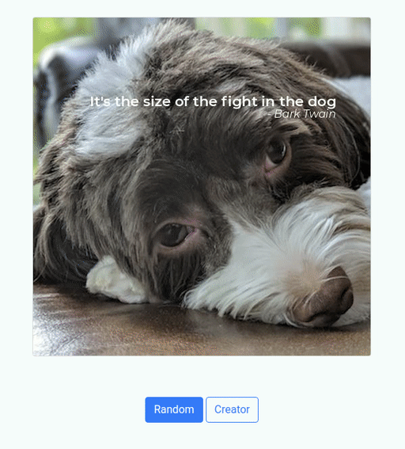

<!-- PROJECT SHIELDS -->
<!--
*** I'm using markdown "reference style" links for readability.
*** Reference links are enclosed in brackets [ ] instead of parentheses ( ).
*** See the bottom of this document for the declaration of the reference variables
*** for contributors-url, forks-url, etc. This is an optional, concise syntax you may use.
*** https://www.markdownguide.org/basic-syntax/#reference-style-links
-->
<p align="center">

[comment]: <> ([![LinkedIn][linkedin-shield]][linkedin-url])
</p>


<!-- PROJECT LOGO -->
# Meme Generator
_Simple meme image generator created for Udacity Nanaodegree program_.

<!-- ABOUT THE PROJECT -->
## About The Project



A simple meme generator written in python. This project was created as part of Udacity's Python Nanaodgree 
program nd303. Includes a Flask based web interface and a cli interface. The cli interface will save the 
the generated memes to disk.


### Built With

* [Flask](https://github.com/pallets/flask): Simple web server interface
* [Pandas](https://github.com/pandas-dev/pandas): Easy processing meme text from csv files
* [Pillow](https://github.com/python-pillow/Pillow): Image processing to add text


<!-- GETTING STARTED -->
## Getting Started

To get a local copy up and running follow these simple steps.

### Prerequisites

`pdftotext` binary is required and can be installed...
* On Ubuntu 20.04
  ```sh
  sudo apt install poppler-utils
  ```

### Installation

1. Clone this repo.
   ```sh
   git clone https://github.com/moon0440/meme-generator.git
   ```
2. Setup [virtual env](virtual-env-docs) inside project folder and activate.
   ```sh
   cd ./meme-generator
   python3 -m venv .venv
   source .venv/bin/activate
   ```
3. Install python deps
   ```sh
   pip install -r requirements.txt
   ```


<!-- USAGE EXAMPLES -->
## Usage

Use this space to show useful examples of how a project can be used. Additional screenshots, code examples and demos work well in this space. You may also link to more resources.

#### Using the cli

```sh
$ python main.py --help
usage: main.py [-h] [-p PATH] [-b BODY] [-a AUTHOR]

optional arguments:
  -h, --help            show this help message and exit
  -p PATH, --path PATH  Path to and image file.
  -b BODY, --body BODY  Body or Content written to image.
  -a AUTHOR, --author AUTHOR
                        Author name written to image.
```
Or run the default options **```python main.py```** to create a meme in ```./tmp```

#### Flask Web Development Server
Starting dev server
```sh
$ export FLASK_APP=app
$ flask run
 * Serving Flask app 'app' (lazy loading)
 * Environment: production
   WARNING: This is a development server. Do not use it in a production deployment.
   Use a production WSGI server instead.
 * Debug mode: off
 * Running on http://127.0.0.1:5000/ (Press CTRL+C to quit)
```
Once started(using the default port) go to http://127.0.0.1:5000/


_For more information on this process checkout [Flasks Development Server Documentation](flask-dev-server-docs)_.

## Modules
_For descriptions of roles and responsibilities of modules see [API Documentation](https://moon0440.github.io/meme-generator/)_

<!-- LICENSE -->
## License

Distributed under the MIT License. See `LICENSE` for more information.


<!-- CONTACT -->
## Contact
[![LinkedIn][linkedin-shield]][linkedin-url]


<!-- MARKDOWN LINKS & IMAGES -->
<!-- https://www.markdownguide.org/basic-syntax/#reference-style-links -->
[contributors-shield]: https://img.shields.io/github/contributors/moon0440/repo.svg?style=for-the-badge
[contributors-url]: https://github.com/moon0440/meme-generator/graphs/contributors
[forks-shield]: https://img.shields.io/github/forks/moon0440/repo.svg?style=for-the-badge
[forks-url]: https://github.com/moon0440/meme-generator/network/members
[stars-shield]: https://img.shields.io/github/stars/moon0440/repo.svg?style=for-the-badge
[stars-url]: https://github.com/moon0440/meme-generator/stargazers
[issues-shield]: https://img.shields.io/github/issues/moon0440/repo.svg?style=for-the-badge
[issues-url]: https://github.com/moon0440/meme-generator/issues
[license-shield]: https://img.shields.io/github/license/moon0440/repo.svg?style=for-the-badge
[license-url]: https://github.com/moon0440/meme-generator/blob/master/LICENSE.txt
[linkedin-shield]: https://img.shields.io/badge/-LinkedIn-black.svg?style=for-the-badge&logo=linkedin&colorB=555
[linkedin-url]: https://linkedin.com/in/blakemoon
[virtual-env-docs]: https://docs.python.org/3/library/venv.html
[flask-web-dev-docs]: https://flask.palletsprojects.com/en/2.0.x/server/
